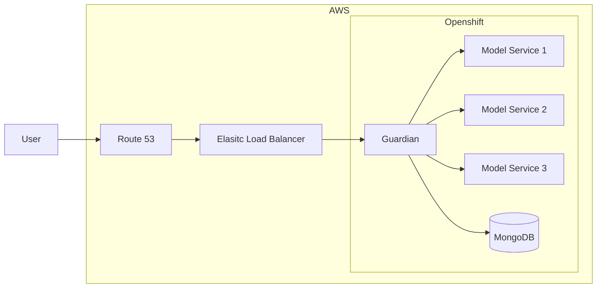
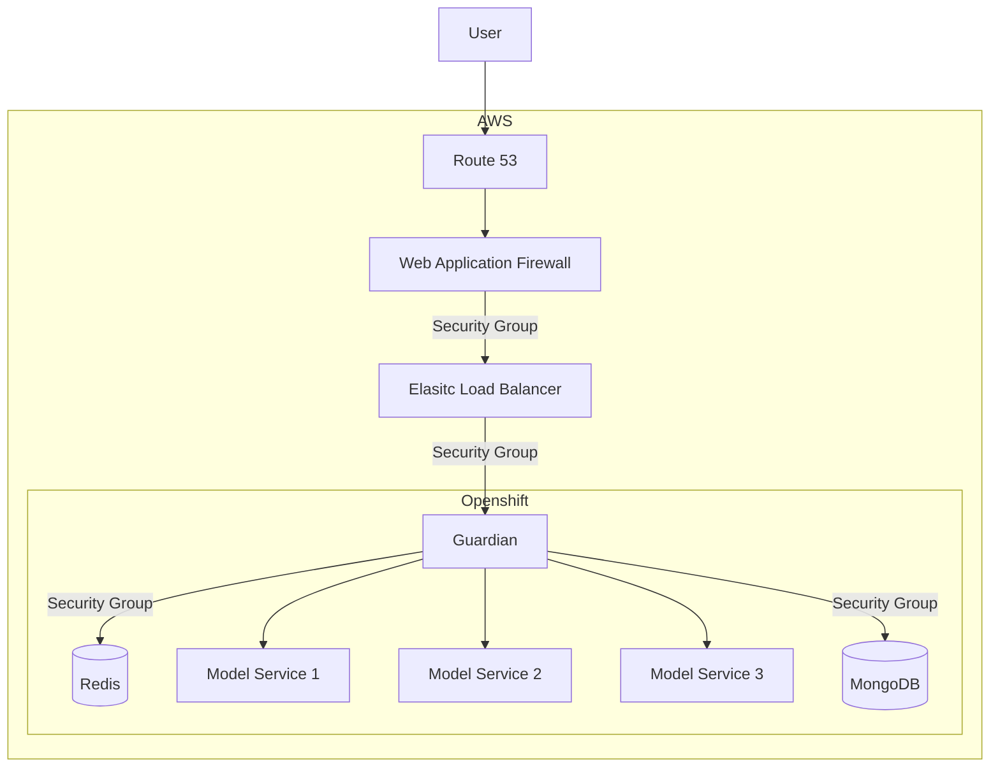

    

 

    <a href="https://open.accelerator.cafe" target="_blank">
        :link: Guardian
    </a>

---

> [!NOTE]
> This project is under active development. The documentations may change as the project evolves.

##### Technology powering Guardian
- Front-end:
    - HTMX
    - JavaScript
- Back-end:
    - Rust
- Infrastructure:
    - OpenShift / Kubernetes
    - Docker
        - Primarily used for containerizing the application
    - Helm
    - OpenTofu
- Database:
    - MongoDB

##### Current Architecture

##### Possible Future Architecture

