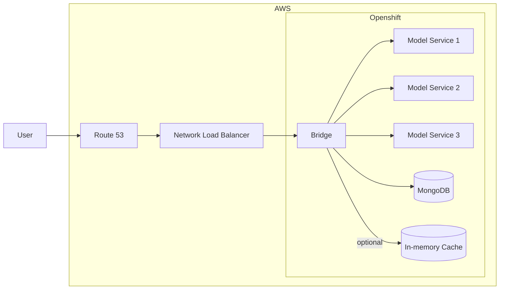
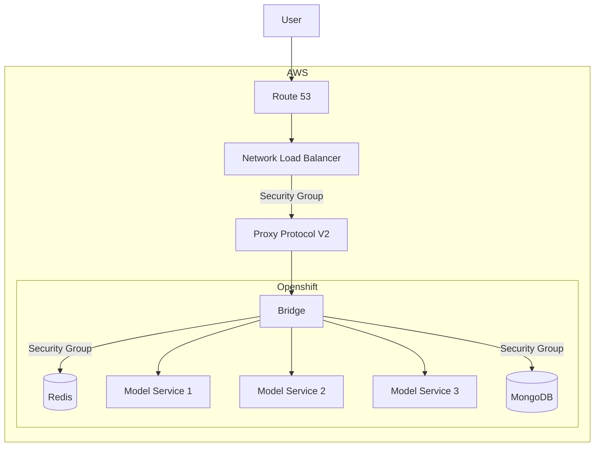

[&#8592; Back](../#OpenBridge)

# Architecture

> [!NOTE]
> This project is under active development. The documentations may change as the project evolves.

 

### Technology powering OpenBridge

-   Front-end:
    -   HTMX
    -   TypeScript
    -   Tailwind CSS
-   Back-end:
    -   Rust
-   Infrastructure:
    -   OpenShift / Kubernetes
    -   Podman
        -   Primarily used for containerizing the application
    -   Helm
    -   OpenTofu
-   Database:
    -   MongoDB
    -   Redis / KeyDB (Optional)
-   Dev Tooling:
    -   rust-analyzer
    -   bacon
    -   tsc
    -   typescript-language-serve (ts_ls)
    -   tailwind cli

 

### Current Architecture

 

### Possible Future Architecture

