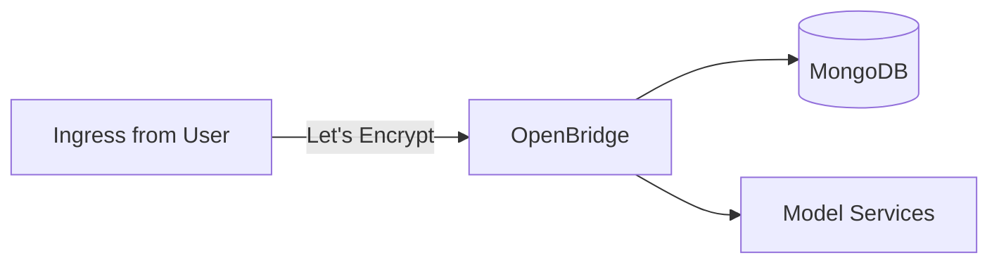

[&#8592; Back](../#bridge)

# Runbook

> [!NOTE]
> This project is under active development. The run book may change as the project evolves. The run book may also not cover everything. Reach out to the maintainers for the most up-to-date information.

> What could go wrong as of (2024-08-01)?

<br>

It's best to first think about how the data flows through the OpenBridge:



What does the authenication flow look like?


What does the user initiated flow look like?


> [!TIP]
> Any of the arrows in the diagrams above could error. When encountering a problem with OpenBridge, it is best to determine where the problem occurred.
>
> Possible failures:
>
> -   If the user is unable to login, the problem could be with IBM Verify.
> -   If the user is unable to generate access tokens, the problem could be with the database. It could also be OpenBridge specific.
> -   If the user is unable to access a model service, the problem could be with the model service.
>     -   Find out what status could was returned to the user
>     -   The model service could be down. Check the health of the model service either through [pulse](https://open.accelerator.cafe/pulse) or the OpenShift console

> I have narrowed down to where the problem may be originating from. What do I do next?

The best thing to do next is to check the logs from OpenBridge. You can check the logs through the OpenShift console or through the command line. You can enter the following command to check the logs from OpenBridge through the command line:

```bash
kubectl logs -n bridge bridge-tls-<pod_id>
```

<br>

### Example #1

> Problem: User reports that they are unable to login. When they try to access the group-admin page, they were faced with a forbidden code 403 error.

1. We check the log

    ```bash
    kubectl logs -n bridge bridge-tls-<pod_id>
    ```

    Output:

    ```
    2024-08-01T13:42:45.523259Z  WARN ThreadId(34) bridge::web::bridge_middleware::cookie_check: src/web/bridge_middleware/cookie_check.rs:70: OpenBridge cookie not found from ip Some(100.64.0.4:45712)
    ```

    We see that the OpenBridge could not find a cookie from the user's browser.

2. Let's take a closer look in the codebase: cookie_check.rs line 70.
    ```rust
    // code from cookie_check.rs as of 2024-08-01
    match req.cookie(COOKIE_NAME).map(|c| c.value().to_string()) {
    	Some(v) => {
    		let bridge_cookie_result = serde_json::from_str::<BridgeCookie>(&v);
    		match bridge_cookie_result {
    			Ok(gcs) => {
    				req.extensions_mut().insert(gcs);
    				self.service
    					.call(req)
    					.map_ok(ServiceResponse::map_into_left_body)
    					.boxed_local()
    			}
    			Err(e) => {
    				warn!("OpenBridge cookie deserialization error: {:?}", e);
    				let res = HttpResponse::InternalServerError()
    					.finish()
    					.map_into_right_body();
    				Box::pin(async { Ok(req.into_response(res)) })
    			}
    		}
    	}
    	None => {
    		warn!("OpenBridge cookie not found from ip {:?}", req.peer_addr()); // <-- Line 70
    		let res = HttpResponse::Forbidden().finish().map_into_right_body();
    		Box::pin(async { Ok(req.into_response(res)) })
    	}
    }
    ```
    While some knowledge of the Rust programming language would help quite a bit, we can see that in this pattern match that indeed there is no cookie.

<br>

### Example #2

> Problem: User tried to log in using IBM ID with their @ibm email address. They successfully were redirected to IBM Verify, but when they were redirected back to OpenBridge, they were faced with an internal server error.

1. Check the logs

    ```bash
    kubectl logs -n bridge bridge-tls-<pod_id>
    ```

    Output:

    ```
    2024-08-01T14:45:27.416619Z ERROR ThreadId(28) bridge::web::route::auth: src/web/route/auth/mod.rs:146: Error: Kind: An error occurred when trying to execute a write operation: WriteError(WriteError { code: 11000, code_name: None, message: "E11000 duplicate key error collection: bridge.users index: email dup key: { email: \"choi@ibm.com\" }", details: None }), labels: {}
    ```

    There is a lot of information here, but the key part is the "message" field. It seems that there is a duplicate key error in the database. This could be because the user already exists in the database.

    If you port-forward to the MongoDB pod, you can check the User collection, indeed "choi@ibm.com" exists. Since there is a Unique Index on the email field, you cannot have duplicate emails.

    Why is OpenBridge trying to register this user if they already exist? Let's look at the code:

    ```rust
    // code from auth/mod.rs as of 2024-08-01
    let (id, user_type) = match r {
    	Ok(user) => (user._id, user.user_type),
    	// user not found, create user
    	Err(_) => {
    		// get current time in time after unix epoch
    		let time = time::OffsetDateTime::now_utc();
    		// add user to the DB as a new user
    		let r = log_error!( // <-- Line 146
    			dt.insert(
    				User {
    					_id: ObjectId::new(),
    					sub: subject,
    					user_name: name.clone(),
    					email: email.clone(),
    					groups: vec![],
    					user_type: UserType::User,
    					created_at: time,
    					updated_at: time,
    					last_updated_by: email,
    				},
    				USER,
    			)
    			.await
    		)?;
    		(
    			r.as_object_id().ok_or_else(|| {
    				BridgeError::GeneralError("Could not convert BSON to objectid".to_string())
    			})?,
    			UserType::User,
    		)
    	}
    };

    ```

    As seen above, we are indeed failing to insert the user due to the unique index. In this pattern match, we see we are matching "r" with Err. A little above, we see the following code:

    ```rust
    let r: Result<User> = db
    	.find(
    		doc! {
    			"sub": &subject
    		},
    		USER,
    	)
    	.await;
    ```

    Looks like when the user is redirected back to OpenBridge from IBM Verify with the user profile data, we are querying out databsed based on the "sub" field. That's weird, why "sub" and not "email?" This is because the "sub" field is guaranteed by IBM Verify to be unique and specifically tied to a specific user.

    No super clear due to the technical details to our upstream authorization service, but our user originally authenticated with W3 and then later tried to log in with IBM ID. The User needs to use W3 to log in.

    Once the maintainers implement a check to that the email has been verified, we can update the code above to query based on the email field and send back the proper error message.
